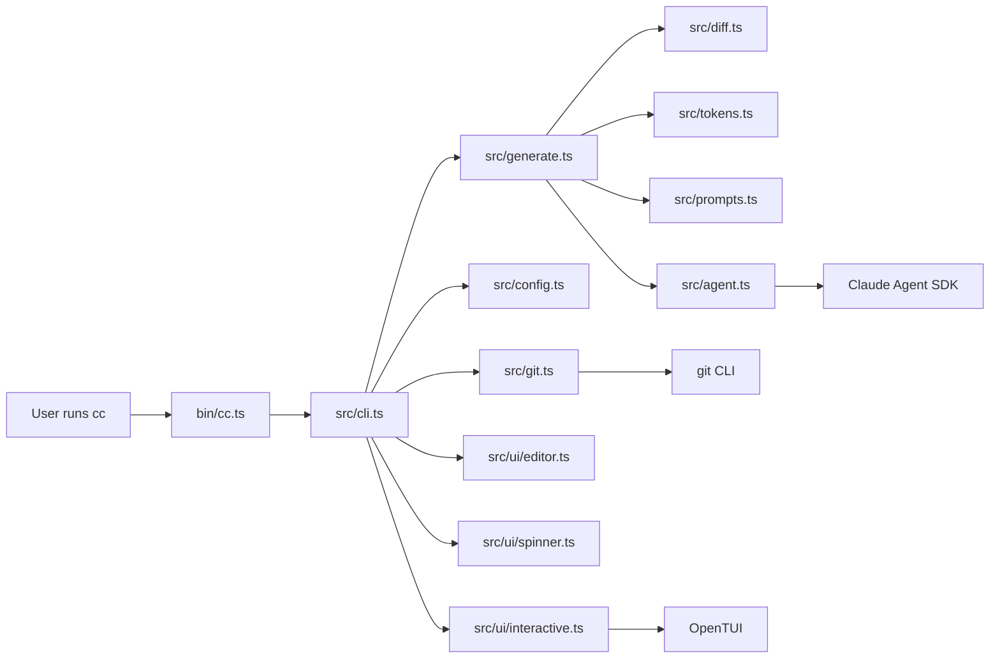
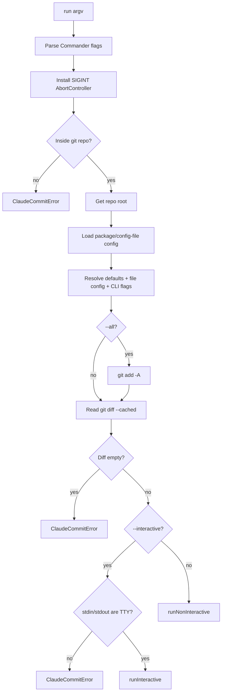
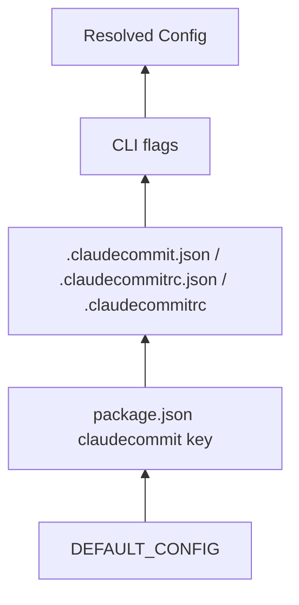
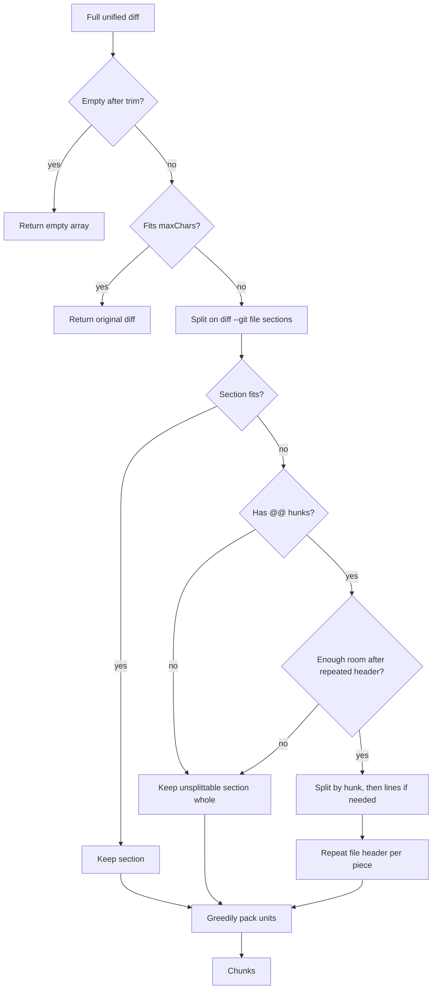
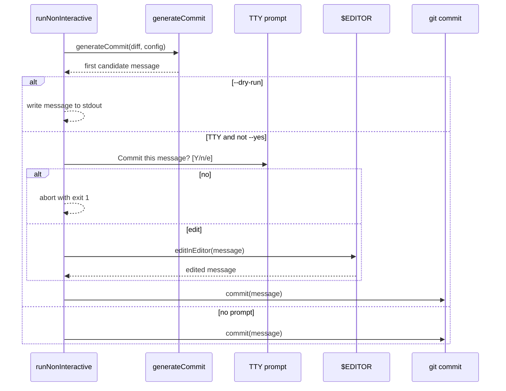
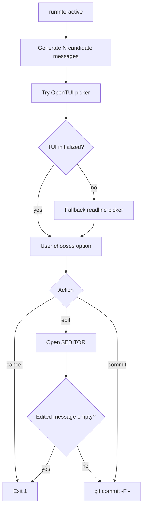

# claudecommit Codebase Walkthrough

`claudecommit` is a Bun/TypeScript CLI that generates git commit messages from
the staged diff. It uses the Claude Agent SDK as a prompt-in/text-out model
runner, authenticating with your Claude Code subscription; API credentials in
the environment are used only when the `allowApiKey` config option is enabled.

The codebase is intentionally small. The core path is:

1. Parse CLI flags.
2. Load configuration.
3. Read the staged git diff.
4. Split large diffs into model-sized chunks.
5. Ask a summary model to summarize each chunk.
6. Ask a final model to turn the summaries into one or more commit messages.
7. Print, prompt, edit, or commit depending on CLI mode.

## Repository Map

```text
.
├── bin/cc.ts                 # executable entrypoint for `cc` / `claudecommit`
├── index.ts                  # library exports for programmatic use
├── src/
│   ├── cli.ts                # Commander CLI and top-level orchestration
│   ├── generate.ts           # two-stage commit-message generation pipeline
│   ├── agent.ts              # Claude Agent SDK wrapper
│   ├── git.ts                # git command adapter
│   ├── config.ts             # config discovery, sanitization, and precedence
│   ├── diff.ts               # structure-aware diff chunking
│   ├── prompts.ts            # summary/final prompt builders and response cleanup
│   ├── tokens.ts             # rough token/character budget helpers
│   ├── types.ts              # shared TypeScript interfaces
│   ├── errors.ts             # user-facing error type
│   └── ui/
│       ├── editor.ts         # confirmation prompt and $EDITOR integration
│       ├── interactive.ts    # OpenTUI picker for multiple candidate messages
│       └── spinner.ts        # stderr progress spinner
└── test/                     # Bun tests for config, diff, prompts, tokens
```

## Top-Level Architecture



`bin/cc.ts` is deliberately thin: it imports `run()` from `src/cli.ts`, passes
`process.argv.slice(2)`, and converts the returned code into `process.exitCode`.
Unexpected failures get a stack trace. Expected, user-facing failures are handled
inside `src/cli.ts` as `ClaudeCommitError`.

`index.ts` is the library entrypoint. It re-exports the generation pipeline,
prompt builders, config helpers, git adapter, error type, and shared types so the
same building blocks can be used outside the CLI.

## CLI Control Flow

`src/cli.ts` owns the command-line user experience. It defines all Commander
flags, maps relevant flags into config overrides, validates the repository
state, and chooses between interactive and non-interactive flows.



Important CLI details:

- `--dry-run` writes only the generated message to stdout, which makes
  `cc --dry-run | git commit -F -` possible.
- The spinner writes to stderr only, so stdout stays clean for piping.
- Confirmation is only shown when stdin and stdout are both TTYs. In a pipe or
  other non-TTY context, the command skips the prompt.
- `SIGINT` is converted into an `AbortController` that is passed into generation.
- `--interactive` is rejected unless the process has an interactive terminal.

## Configuration

`src/config.ts` defines the full runtime `Config` and how partial config values
are loaded and merged.



Precedence is low to high:

1. Built-in `DEFAULT_CONFIG`.
2. `package.json` under the `claudecommit` key at the repo root.
3. The nearest `.claudecommit.json`, `.claudecommitrc.json`, or
   `.claudecommitrc`, searched from the current directory up to the repo root.
4. CLI flags.

`sanitizePartial()` is intentionally conservative. It ignores unknown keys and
keys with the wrong type, clamps `interactiveTemperature` to `0..2`, floors
counts and token budgets, and only deep-merges the nested `models` object.

Defaults worth knowing:

- Summary model: `sonnet[1m]`
- Final model: `haiku`
- `maxChunkTokens`: `600_000`
- `charsPerToken`: `3.5`
- `interactiveCount`: `3`
- `interactiveTemperature`: `1`

## Generation Pipeline

`src/generate.ts` is the center of the product. It accepts a staged diff plus a
resolved `Config`, and returns candidate commit messages, intermediate summaries,
chunk count, and reported model cost.


The pipeline has two model stages:

1. **Summarization stage**
   - `buildSummarySystem()` creates stable summary instructions.
   - `buildSummaryUser(chunk, index, total)` wraps one chunk.
   - `runPrompt()` sends each chunk to the configured summary model.
   - Progress labels distinguish single-diff and multi-part diff reads.

2. **Final message stage**
   - `buildFinalSystem(config)` encodes formatting rules such as Conventional
     Commits, gitmoji, templates, custom prompt text, and multiline bodies.
   - `buildFinalUser(summaries, count)` asks for one message or several
     delimiter-separated options.
   - `runPrompt()` sends the final prompt to the configured final model.
   - If multiple options are requested, `interactiveTemperature` is applied when
     available; if the model rejects that override, generation retries without it.

After the final response:

- `parseOptions()` splits multi-option responses on `===OPTION===`.
- `cleanMessage()` strips wrapping code fences or whole-message quotes.
- `dedupe()` removes duplicate options.
- Empty final output becomes a `ClaudeCommitError`.

## Diff Chunking

Large diffs are split in `src/diff.ts`. The splitter is structure-aware: it tries
to preserve useful git context instead of slicing blindly by character count.



The key behavior:

- File sections are detected by `diff --git`.
- Hunk sections are detected by `@@`.
- When a file is split, the file header is repeated so each chunk remains
  understandable to the summary model.
- Binary patches, renames, mode-only changes, or sections without hunks are kept
  whole even if oversized because there is no safe internal boundary.
- A tiny-budget guard avoids creating a model request per character when the
  repeated header would consume nearly all available budget.

`src/tokens.ts` backs this with a rough conversion between token budgets and
character budgets. It intentionally avoids a real tokenizer to keep the CLI light
and fast.

## Claude Agent SDK Adapter

`src/agent.ts` wraps `@anthropic-ai/claude-agent-sdk` in a single function:
`runPrompt(prompt, opts)`.

The wrapper makes model calls intentionally narrow:

- `tools: []` disables tool use.
- `maxTurns: 1` makes each call a single-turn completion.
- `settingSources: []` ignores user/project Claude settings, `CLAUDE.md`, MCP,
  and plugins for a clean text-only request.
- `includePartialMessages` is enabled only when a caller provides `onText`.
- `abortController` is passed through for cancellation.
- Optional temperature is injected through `CLAUDE_CODE_EXTRA_BODY` while
  preserving any existing JSON body.
- API credential variables (`ANTHROPIC_API_KEY` / `ANTHROPIC_AUTH_TOKEN`) are
  stripped from the subprocess environment unless the `allowApiKey` config
  option is enabled (`buildSubprocessEnv`), so billing stays on the
  subscription by default.

The SDK stream is reduced to a `ModelResult`:

- Assistant text from the final `result` message.
- `total_cost_usd`, defaulting to `0`.
- Served model name when available from `modelUsage`.

Known assistant error codes are translated into actionable `ClaudeCommitError`
messages, covering auth, billing, rate limit, overloaded service, missing model,
and max-output failures.

## Git Adapter

`src/git.ts` isolates shell access to git. Most operations use Bun's shell helper
and throw `GitError` with stderr on failure.

Main operations:

- `isGitRepo()` checks `git rev-parse --is-inside-work-tree`.
- `getRepoRoot()` returns `git rev-parse --show-toplevel`.
- `getStagedDiff()` returns `git diff --cached --no-color`.
- `getStagedFiles()` parses `git diff --cached --name-status`.
- `stageAll()` runs `git add -A`.
- `getStagedStat()` returns `git diff --cached --stat --no-color`.
- `getCurrentBranch()` returns the current branch name or `HEAD`.
- `commit(message)` pipes the message to `git commit -F -`.

The commit path is worth calling out: the message is passed over stdin to
`git commit -F -`, so multiline messages, leading dashes, and special characters
are handled without writing a commit-message temp file.

## Non-Interactive Commit Flow

The non-interactive path lives in `runNonInteractive()` inside `src/cli.ts`.



In verbose mode, the command prints chunk count, total reported cost, and each
intermediate summary to stderr. After committing, verbose mode also shows the
staged stat summary.

## Interactive Mode

`src/ui/interactive.ts` handles `cc -i`.

Interactive mode first calls `generateCommit()` with `count =
config.interactiveCount`, which asks the final model to produce multiple distinct
messages. Then it opens an OpenTUI selection screen.



The TUI shows:

- A scrollable staged diff pane.
- A candidate-message picker.
- Keyboard actions for selection, diff scrolling, commit, edit, and cancel.

The full diff is always used for generation, but display truncates after
`100_000` characters so the TUI remains usable.

If OpenTUI cannot initialize, the module falls back to a plain readline prompt
that supports choosing by number, editing with `e N`, or quitting with `q`.

## Editor, Prompting, and Spinner Utilities

`src/ui/editor.ts` contains two separate concerns:

- `confirmCommit()` asks for yes/no/edit on stderr using `readline`.
- `editInEditor()` writes the initial message to a secure temp file, launches the
  editor, reads the result, trims trailing whitespace, and removes the temp file.

The editor command follows git-like precedence:

1. `GIT_EDITOR`
2. `VISUAL`
3. `EDITOR`
4. `vi`

The temp file uses a random UUID, exclusive creation, and `0600` permissions.

`src/ui/spinner.ts` is a small stderr-only spinner. It hides/restores the cursor,
updates labels as generation phases change, and is disabled when stderr is not a
TTY.

## Prompt Formatting Rules

`src/prompts.ts` is where product behavior becomes model instructions.

The final system prompt changes based on config:

- Default mode asks for a concise, imperative, single-line subject.
- Conventional Commit mode asks for `type(scope): description` and provides a
  curated type list.
- Gitmoji mode asks for one leading gitmoji and gives a compact guide.
- Template mode requires the subject to match the template and substitute
  `{message}`.
- Multiline mode asks for a subject, blank line, and concise body.
- Custom prompt text is appended as additional user instructions.

The final user prompt changes based on count:

- `count <= 1`: provide the summaries and ask for one message.
- `count > 1`: ask for exactly that many distinct messages, separated by the
  sentinel line `===OPTION===`.

## Types and Error Boundaries

`src/types.ts` defines the shared contracts:

- `Config` and `PartialConfig`
- `ModelConfig`
- `ModelResult`
- `FileChange`

`src/errors.ts` defines `ClaudeCommitError`, the marker for expected failures.
The CLI catches this type and prints `error: ...` without a stack trace. Other
exceptions are considered unexpected and bubble to `bin/cc.ts`, which prints a
debuggable stack.

`src/git.ts` also defines `GitError`. That error is not specially formatted by
the CLI today, so git failures outside explicit `ClaudeCommitError` paths behave
as unexpected errors.

## Test Coverage

The test suite uses `bun test`.

```text
test/config.test.ts   # config sanitization, precedence, discovery, merge rules
test/diff.test.ts     # empty/small diffs, file splitting, hunk splitting,
                      # oversized hunk splitting, binary sections, tiny budgets
test/prompts.test.ts  # final prompt variants, option parsing, message cleanup
test/tokens.test.ts   # token estimation and budget conversion
```

There are no tests for the live Claude Agent SDK path, git commit execution, or
OpenTUI interaction. Those parts are mostly isolated behind small adapter modules,
which keeps the existing unit tests focused on deterministic logic.

## Where To Start When Changing Things

- **CLI flags or command behavior:** start in `src/cli.ts`, then update
  `README.md` and config tests if a flag maps into config.
- **Commit-message style:** start in `src/prompts.ts` and add prompt tests.
- **Large-diff behavior:** start in `src/diff.ts` and add fixtures to
  `test/diff.test.ts`.
- **Model calling behavior:** start in `src/agent.ts`; keep the no-tools,
  single-turn isolation in mind.
- **Interactive UX:** start in `src/ui/interactive.ts`; remember it has both the
  OpenTUI path and the readline fallback.
- **Configuration:** start in `src/config.ts` and update `test/config.test.ts`.

## Development Commands

```sh
bun test
bun run typecheck
bun run bin/cc.ts --help
```

Use Bun-native commands in this repository. `CLAUDE.md` explicitly asks agents to
prefer Bun over Node, npm, yarn, pnpm, or npx equivalents.
